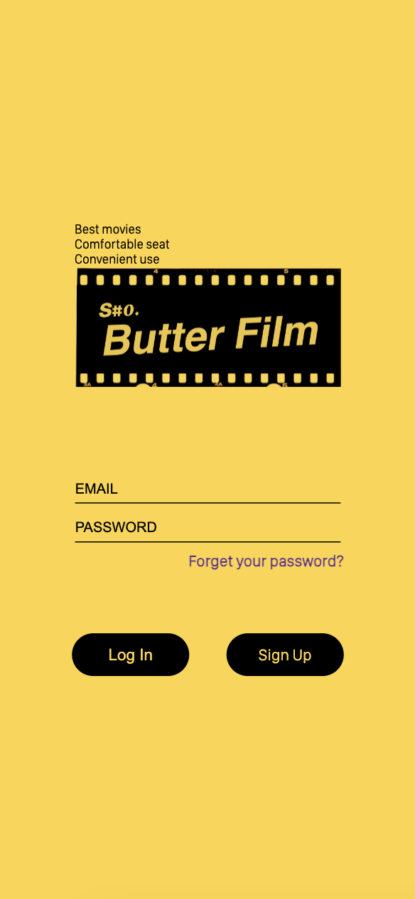
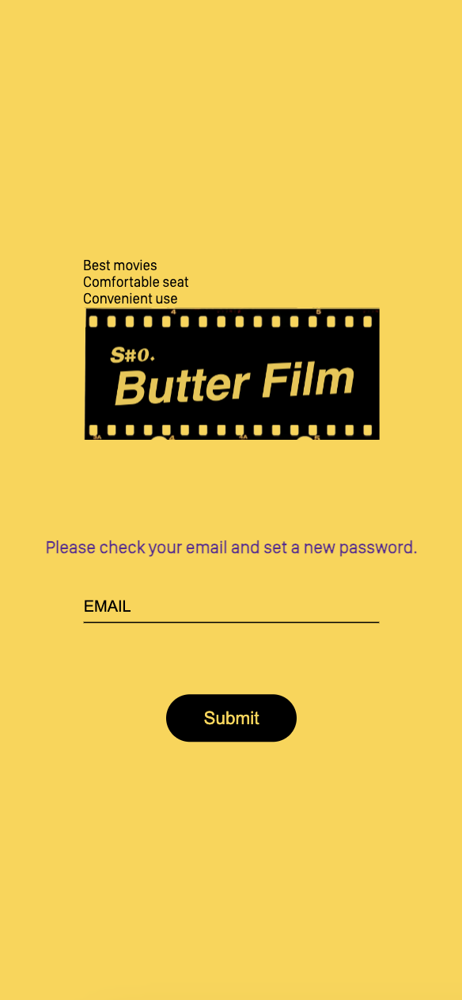
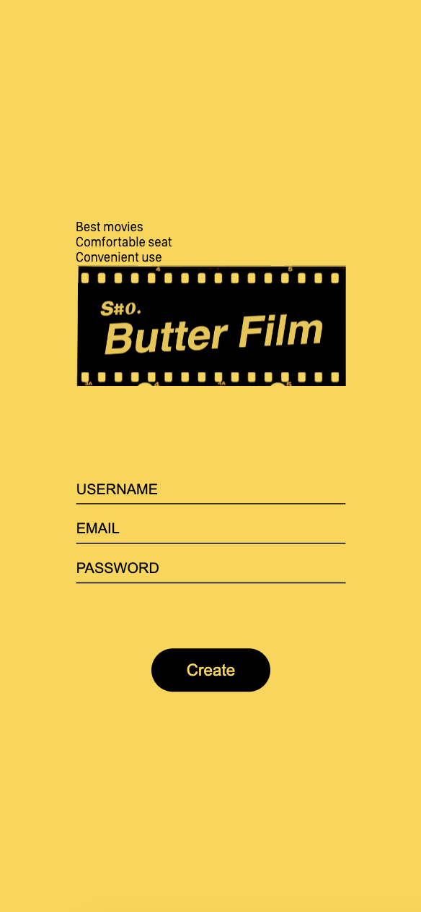
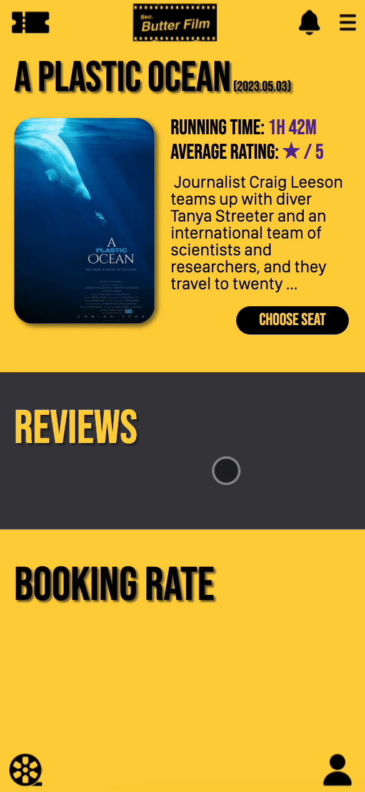
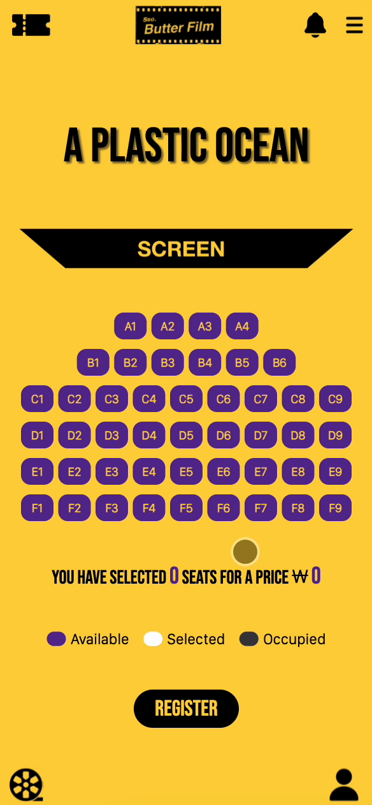
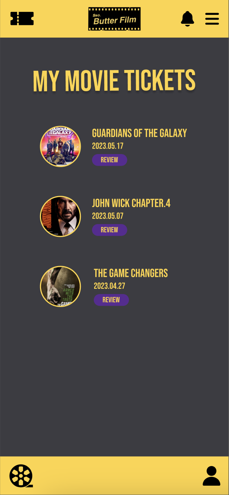
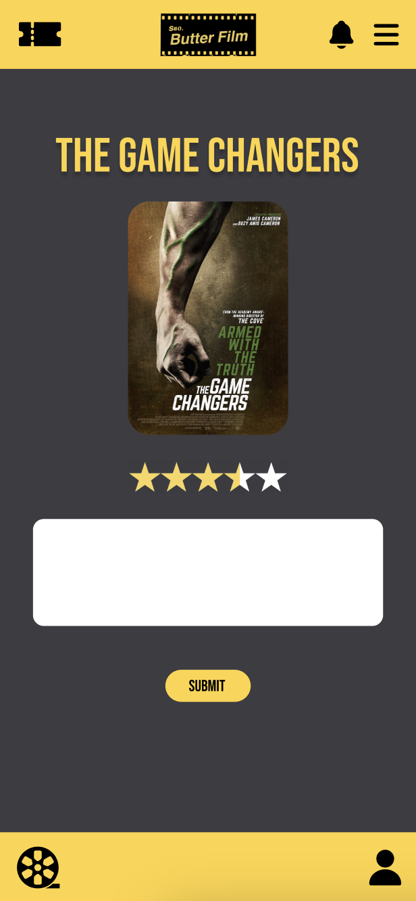

# Butter Film

`Butter Film`은 가상의 영화관 예매 사이트 프로젝트로, 팀으로 진행한 Database 과제입니다.

이 프로젝트는 `MySQL`, `Express.js`, `Node.js`를 활용하여 서버에서 예매 정보를 저장하고 불러오는 기능을 구현하는 것을 목표로 진행하였습니다.

사용자는 회원가입 후 로그인하여 다양한 영화 정보를 확인하고 예매할 수 있습니다.

> 💡 Reference & Movie images copyright : [IMDb](https://www.imdb.com/?ref_=nv_home)

 

## Stack and Tools

### Frontend

### Backend

### Database

 

## Figma

[Figma](https://www.figma.com/file/iBNVkqTC4pqAmgS2LaKrB2/Butter-Film?type=design&node-id=0-1&t=83dbhS0XfIGTcFm6-0)

 

## How to run and Test in local environment

1. 깃 클론 합니다.
2. `server.js` 파일을 실행합니다.
3. 웹 브라우저에서 `http://localhost:포트번호` 로 접속합니다.
4. 회원가입 후 로그인하여 영화 정보를 확인하고 예매할 수 있습니다.

> ⚠️ 프로젝트에서는 `bcrypt` 를 사용하여 비밀번호를 해싱하였습니다.  
> 일부 Mackbook의 M 시리즈에서는 작동하지 않을 수 있습니다.  
> 따라서 `bcrypt` grade down을 고려할 가능성이 존재합니다.
> 자세한 내용은 [bcrypt grade down](https://www.npmjs.com/package/bcrypt#versions)를 참조하세요.

 

## Preview

|                                 Index                                 |                                Password Reset                                 |
| :-------------------------------------------------------------------: | :---------------------------------------------------------------------------: |
|  |  |

|                                Sign Up                                 |                                 Home                                 |
| :--------------------------------------------------------------------: | :------------------------------------------------------------------: |
|  |  |

|                                 Booking                                 |                                Choose Seats                                 |
| :---------------------------------------------------------------------: | :-------------------------------------------------------------------------: |
|  |  |

|                                My Movie Tickets                                |                                 Review                                 |
| :----------------------------------------------------------------------------: | :--------------------------------------------------------------------: |
|  |  |

|                                 Profile                                 |                                 Notification                                 |
| :---------------------------------------------------------------------: | :--------------------------------------------------------------------------: |
|  |  |

